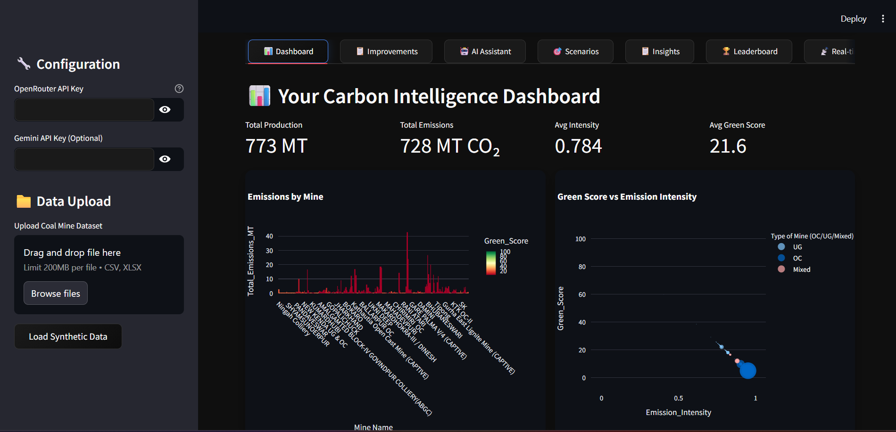
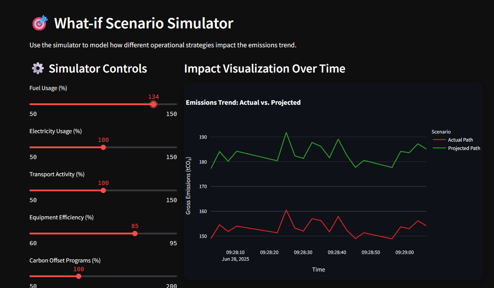

# ⚡ Coal Mine Carbon Neutrality Co(al)-Pilot

[](https://streamlit.io)
[](https://www.python.org)

> 🌍 An interactive AI-powered dashboard to monitor, analyze, and reduce carbon emissions in coal mining operations.

---

## ✨ Features

✅ Secure login with user & admin roles  
✅ Modern dark-themed UI with custom design  
✅ Upload and validate mine emissions datasets (CSV/XLSX)  
✅ Automated emission calculation & green score ranking  
✅ AI-powered improvement recommendations (OpenRouter, Gemini)  
✅ Real-time emissions tracking & simulator  
✅ Personal and global leaderboard  
✅ Report generation in markdown  

---

## 🎯 App Screenshots


| Dashboard                                        | What-if Scenario                                 |
| ------------------------------------------------ | -----------------------------------------------  |
|            |              |

---

## 🛠️ Architecture

- **Frontend:** [Streamlit](https://streamlit.io)
- **Backend Database:** SQLite
- **AI Integrations:**
  - OpenRouter AI (Chat-based assistant)
  - Google Gemini (Report & Roadmap generation)
- **Visualization:** Plotly

---

## ⚙️ How It Works

1. **Login:**
   - Secure portal with predefined test accounts (admin / user1 / user2 / user3)
2. **Upload Data:**
   - Upload mine-level CSV or XLSX datasets
   - Automatic validation and emissions calculation
3. **Dashboard:**
   - Interactive metrics, bar charts, scatter plots
   - Personalized leaderboard
4. **Improvement Roadmap:**
   - AI-generated recommendations for carbon reduction
5. **Simulator:**
   - What-if scenarios for operational strategy
6. **Real-time Monitor:**
   - Simulated Scope 1/2/3 tracking
7. **Admin Panel:**
   - User management
   - Global leaderboard maintenance

---

## 📦 Project Structure

```
📁 Coal-pilot/
│
├── app.py         # Main Streamlit app
├── requirements.txt  # Python dependencies
├── README.md        
```

---

## 🧪 Test Accounts

| Username | Password |
|----------|----------|
| admin    | admin    |
| user1    | user1    |
| user2    | user2    |
| user3    | user3    |

---

## 📋 Setup & Installation

### 1️⃣ Clone this repository
```bash
git clone https://github.com/aadvaitav/Coal-pilot
cd Coal-pilot
```

### 2️⃣ Install dependencies
```bash
pip install -r requirements.txt
```

### 3️⃣ (Optional) Create a virtual environment
```bash
python -m venv venv
source venv/bin/activate  # On Windows: venv\Scripts\activate
```

### 4️⃣ Run the app
```bash
streamlit run app.py
```

---

## 📁 Data Requirements

✅ Required columns:
- `Mine Name`
- `State/UT Name`
- `Type of Mine (OC/UG/Mixed)`

✅ Optional columns (defaults used if missing):
- `Coal/ Lignite Production (MT) (2019-2020)`
- `Transport Distance (km)`
- `Diesel Consumption (L)`
- `Electricity Consumption (kWh)`
- `Latitude`, `Longitude`

---

## 🤖 AI Integrations

- **OpenRouter**: for chat-based analysis & suggestions
- **Google Gemini**: for generating detailed improvement roadmaps and executive reports

> API keys can be securely entered in the sidebar configuration.

---

## 👑 Admin Panel Features

- View and clear global leaderboard
- Manage user accounts
- System statistics dashboard
- Add sample data for users

---

## 🌍 Real-time Simulation

- Simulated Scope 1, 2, 3 emissions
- Live monitoring with automatic refresh
- What-if scenario planning for operational strategies

---

## 🙏 Acknowledgments

- Built with ❤️ using [Streamlit](https://streamlit.io), [Plotly](https://plotly.com), [OpenRouter](https://openrouter.ai), and [Google Gemini](https://ai.google).

---

## ⭐ Contributing

Contributions are welcome!  
Please open issues or pull requests to help improve this project.

---

## 📬 Contact

If you have any questions or feedback, feel free to open an issue or contact me via [GitHub](https://github.com/aadvaitav).

---
